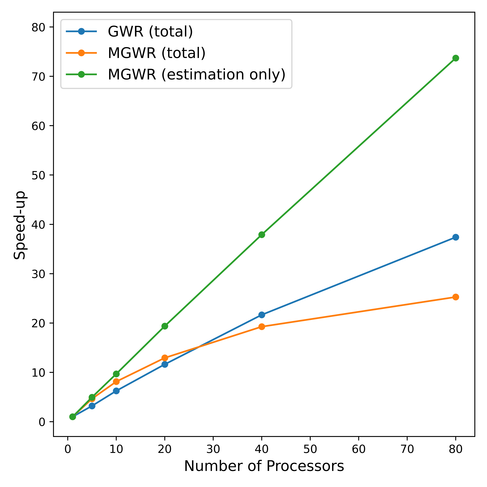

# Summary

`fastgwr` is a command-line interface (CLI) tool for fast parallel fitting of Geographically Weighted Regression (GWR) models. The single-bandwidth GWR, as well as the multi-bandwidth Multiscale GWR (MGWR) model, are both available in the current version of the software. GWR models are typically computationally intensive in memory and time. To address these challenges, `fastgwr` uses Message Passing Interface (MPI, @gropp1999using) to implement the parallel algorithms developed in @li2019fast and @li2020computational. The program builds on top of the `mpi4py` package [@dalcin2008mpi] which provides bindings of the MPI with python to allow the algorithm to be executed on multiple processors across nodes. The goal of  `fastgwr` is to enable studies of spatial non-stationary processes using large-scale and fine-resolution geospatial datasets.

# Statement of need

GWR models [@fotheringham2003geographically], as one of the fundamental methods in spatial analysis and geography, have been widely applied to examine spatially varying relationships in fields such as environmental studies [@li2010investigating], crime analysis [@cahill2007using], ecology [@windle2010exploring], public health [@lin2011using], and political science [@stewart2021scale]. A recent advancement of GWR named MGWR [@fotheringham2017multiscale] removes the single bandwidth assumption in GWR so that multi-scale processes can be simultaneously modeled. This more advanced and flexible model brings additional challenges in parameter estimation which requires to iteratively fit thousands of GWR models through a backffiting process. The complexity of the calibration makes the model hard to be applied to moderate-sized datasets. For instance, it may take several days of running time to complete the model fitting for a sample size of 5000 observations.

As geospatial data are increasingly available from different sources such as remote sensing, GPS in mobile devices, IoT networks, and so on. The computation demand of GWRs poses a limitation for applying such models in real scientific applications, especially when involving large data sets. To address this problem, @li2019fast and @li2020computational developed parallel fitting algorithms for GWR and MGWR respectively. `fastgwr` incorporates these efforts and provides a simple CLI for users to calibrate large-size GWR models on both desktops and clusters. Recently, `fastgwr` has benefited and enabled a few scholarly publications (e.g. @tasyurek2020rnn; @bilgel2020guns; @wang2020cuda). Additionally, new methods and software have been developed based on the `fastgwr` parallelization framework (see @oshan2019mgwr; @que2021parallel; @tacsyurek2021fastgtwr).

# State of the Field

There are currently existing packages in different languages that allow users to fit GWR and MGWR models. Two most popular open-source options are `mgwr` in python [@oshan2019mgwr] and `GWmodel` in R [@gollini2013gwmodel], both of which provide friendly APIs and are actively maintained. `GWmodel` supports a wide array of geographically weighted models and analysis tools; however, the performance of `GWmodel` is lagged behind and not suitable for large data sets. A comprehensive performance comparison between `GWmodel` and `fastgwr` can be found in @li2019fast and @li2020computational. As for `mgwr`, as mentioned in the previous section, the parallsim of `fastgwr` has been built into `mgwr` by leveraging the `multiprocessing` package. However, the major advantage of `fastgwr` is that the use of MPI-based parallelism allows the program to run in parallel across multiple computer nodes. In this way, `fastgwr` is the only option if the analyst wants to run the GWR program on a high performance computing cluster, which empowers larger-scale analysis that is impossible for a single workstation.  `fastgwr` has been tested on the University of Arizona's Ocelote cluster, and the scalability can be seen in \autoref{fig:example}.

The model fitting results of `fastgwr` have been validated against `mgwr` which can be found in the [notebooks](https://github.com/Ziqi-Li/FastGWR/tree/master/validation%20notebook) in the attached [Gituhb repository](https://github.com/Ziqi-Li/FastGWR).




# Installation

 `fastgwr` is dependent on the `mpi4py` package and a working MPI implementation. The easiest way to install both dependencies is to use `conda`:

```bash
$ conda install mpi4py
```

By installing `mpi4py`, `conda` will also install an MPI implementation based on your computer system (OpenMPI for Mac/Linux; MPICH for Windows). Users may want to check wether the MPI implementation is successfully installed and is on your path by running the `mpiexec` command. Then the `fastgwr` program can be installed from PyPi:

```bash
$ pip install fastgwr
```

After sucessful installation, users can test the functionalities from the command line by running:

```bash
# Using zillow sample data for testing MGWR model fitting.
$ fastgwr testgwr
```
or

```bash
# Using zillow sample data for testing MGWR model fitting.
$ fastgwr testmgwr
```


# Examples
Example call to `fastgwr` to fit a GWR model:

```bash
$ fastgwr run -np 4 -data input.csv -adaptive -constant
```

Example call to `fastgwr` to fit an MGWR model:

```bash
$ fastgwr run -np 4 -data input.csv -adaptive -constant -mgwr
```
where:

```bash
-np 4             Number of processors (e.g. 4).
-data input.csv   Input data matrix. (e.g. input.csv)
                  Can also be URL (e.g. https://raw.github.com/
                  Ziqi-Li/FastGWR/master/Zillow-test-dataset/zillow_1k.csv)
-out results.csv  Output GWR results matrix including local parameter 
                  estimates, standard errors and local diagnostics.
-adaptive         Adaptive Bisquare kernel.
-fixed            Fixed Gaussian kernel.
-constant         Adding a constant column vector of 1 to the design matrix.
-bw 1000          Pre-defined bandwidth parameter. If missing, it will
                  search (golden-section) for the optimal bandwidth and use
                  that to fit the GWR model.
-minbw 45         Lower bound in golden-section search. (e.g. 45)
-mgwr             Fitting an MGWR model.
-chunks           Number of chunks for MGWR computation (set to a larger 
                  number to reduce memory footprint).
```

Alternatively, users can call the CLI from a Jupyter Notebook by prefixing `fastgwr` command  the `!` character. [Examples notebooks](https://github.com/Ziqi-Li/FastGWR/tree/master/validation%20notebook) are available in the [Gituhb repository](https://github.com/Ziqi-Li/FastGWR).


# Dependencies

`fastgwr` is based on the following dependencies:

- Any MPI Implementation (e.g. [OpenMPI](https://www.open-mpi.org): @gabriel2004open, [MPICH](https://www.mpich.org): @gropp1996user)
- `mpi4py` [@dalcin2008mpi]
- `numpy` [@van2011numpy]
- `scipy` [@virtanen2020scipy]
- `click`: https://github.com/pallets/click

# References
